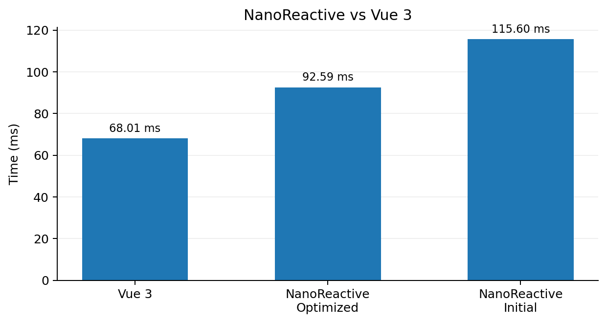

# NanoReactive

A tiny reactive state management library built from scratch in JavaScript.

Built to understand how reactive systems work internally: dependency tracking, invalidation, scheduling, and batching.

## Features

- `ref()` — reactive values
- `reactive()` — reactive objects using `Proxy`
- `effect()` — dependency-based effects
- `computed()` — lazy + cached derived state
- Batching with microtasks
- Conditional dependency cleanup

## Performance

Benchmarked against Vue 3 using 10,000 reactive ref/computed pairs and 100,000 updates.

| Implementation | Time | Relative |
|---|---:|---:|
| Vue 3 | **68.01 ms** | 1.00× |
| NanoReactive (optimized) | **92.59 ms** | 1.36× slower |
| NanoReactive (initial) | **115.60 ms** | 1.70× slower |

## Optimizations

- **Direct `ref` dependencies** — removed generic `WeakMap → Map → Set` lookup from the hot `.value` path.
- **Direct `computed` subscribers** — avoided unnecessary generic dependency tracking.
- **Removed dependency Set copying** — eliminated `[...dep]` allocation during triggering.
- **Incremental cleanup** — retain stable dependencies and remove only stale ones.
- **Batched scheduling** — multiple synchronous updates are flushed together using a microtask.

## What I Learned

- Reactivity is fundamentally **dependency tracking + invalidation + scheduling**.
- The hot path matters more than the overall code size.
- Generic abstractions are convenient, but specialized paths can significantly reduce overhead.
- Benchmarking individual operations is essential before optimizing.
- Correct dependency cleanup is just as important as performance.

